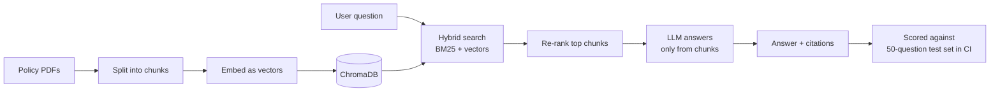

<div align="center">

# 🔍 Policy RAG Assistant

**Ask health insurance questions in plain English. Get answers that cite the exact policy page.**


</div>

---

## 🎯 The problem

Insurance policies are long and hard to read, and a general chatbot will confidently invent coverage details. This assistant answers **only** from the policy documents, cites `[document, page]` for every claim, and says so when the answer isn't there. It's built like a production system: every change is measured against a fixed test set.

> *Example:* "Is physical therapy covered, and is there a visit limit?" → an answer quoting the plan's limit, with a link to the page it came from.

## 🏗️ How it works



## ✨ Features

| Feature | Why it matters | Status |
| --- | --- | --- |
| Citations on every answer | Users can verify; hallucinations are visible | Planned (step 4) |
| "Not found" when the answer isn't in the documents | Refuses instead of guessing | Planned (step 4) |
| Hybrid retrieval (BM25 + vector search) | Catches exact terms like plan codes that vector search misses | Planned (step 6) |
| Cross-encoder re-ranking | Puts the most relevant chunks first | Planned (step 6) |
| Evaluation gated in CI | A change that lowers accuracy fails the build | Planned (step 8) |

## 📊 Results

| Metric | Baseline | Final |
| --- | --- | --- |
| Answer faithfulness | — | — |
| P95 latency | — | — |
| Cost per 1k queries | — | — |

*(Fill in real numbers as you measure them.)*

## 🚀 Run it

```bash
git clone https://github.com/lakshmibollina/policy-rag-assistant.git
cd policy-rag-assistant
python -m venv .venv
source .venv/bin/activate          # Windows: .venv\Scripts\activate
pip install -r requirements.txt
cp .env.example .env               # then add your API key to .env
python scripts/download_data.py    # downloads the policy PDFs into data/raw/
```

## 📁 Data

The assistant answers from public health plan **Summary of Benefits and Coverage (SBC)** documents. Every US health plan must publish one in the same standard format, which makes them good test material: same structure, different numbers.

The PDFs are not stored in Git. [`data/sources.csv`](data/sources.csv) lists each document and where it came from, and `scripts/download_data.py` downloads them, so anyone gets the same set.

[`evals/seed_questions.csv`](evals/seed_questions.csv) holds 10 real questions a customer would ask. They guide what the system must handle and become the start of the test set in step 5.

## 🗺️ Progress

- [x] Step 1: Repo, environment and README
- [ ] Step 2: Collect policy documents and real user questions
- [ ] Step 3: Ingest documents into a vector database
- [ ] Step 4: Answer with citations
- [ ] Step 5: Test set and baseline metrics
- [ ] Step 6: Hybrid search and re-ranking
- [ ] Step 7: Streamlit web app
- [ ] Step 8: CI eval gate
- [ ] Step 9: Final write-up and demo

## 📝 Build log

Decisions and trade-offs for each step are recorded in [docs/build-log.md](docs/build-log.md).
